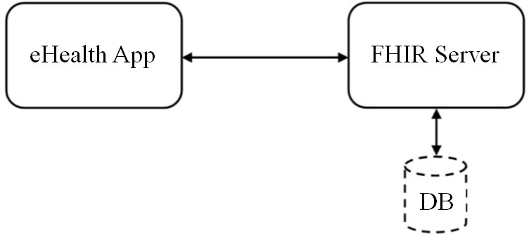
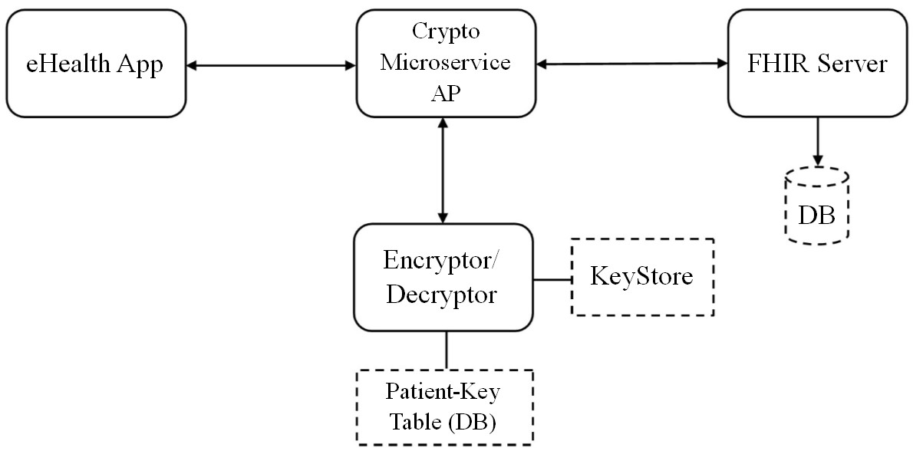
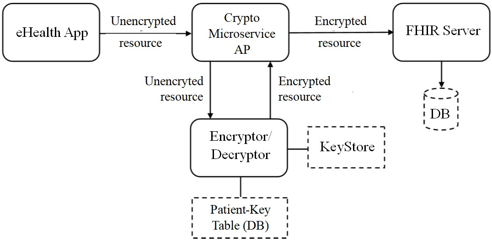
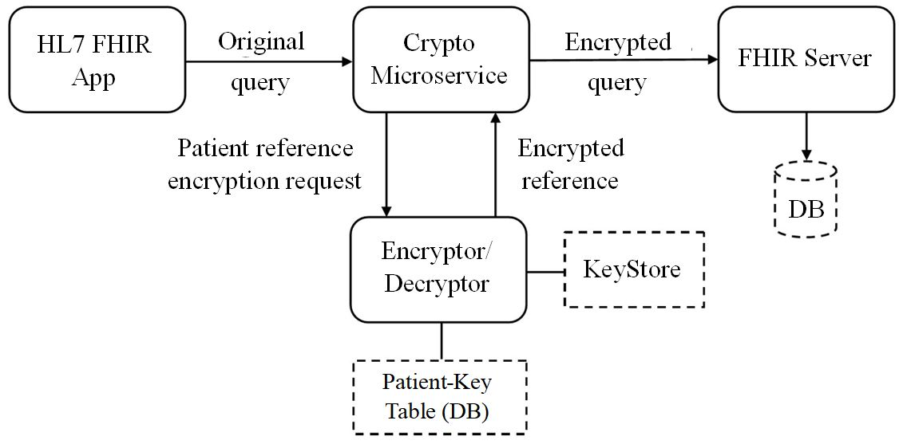
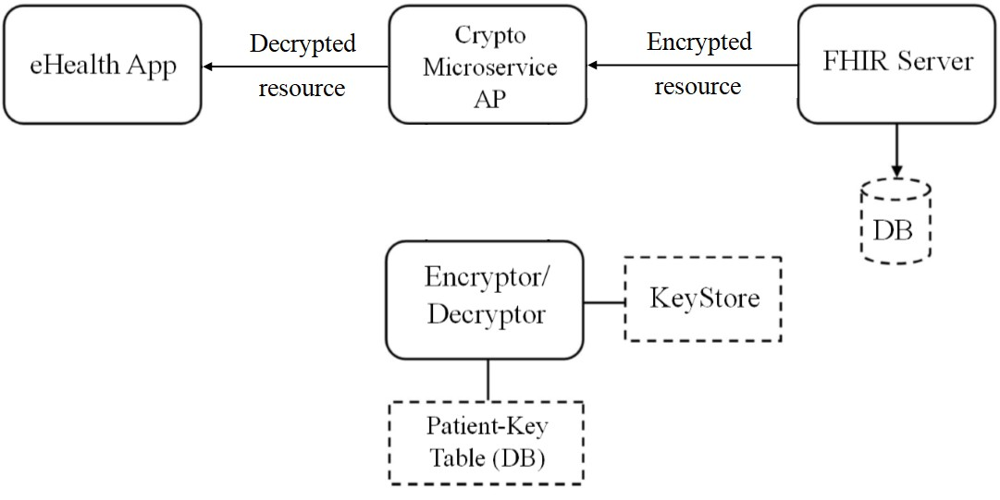

# HL7 FHIR Resource Encryptor/Decryptor Microservice API
The project is described in detail in this <a href="https://repozitorij.uni-lj.si/IzpisGradiva.php?id=103201&lang=eng" target="_blank">thesis</a> *(in Slovenian language)*

# Main goals
The main goal of the **HL7 FHIR Crypto API Microservice** is to ensure a safe transfer of HL7 FHIR resources from the app to FHIR  server, without the end-user experiencing any change in the use of the app. The Crypto API microservice is exposed outwards as a standard HL7 FHIR API interface.

The only change for the end user is that access point for HAPI server is no longer the HAPI server itself, but instead the HL7 FHIR Crypto API Microservice described in this repository. There is also no change in the database itself - all data is saved in the same way and no change in the queries is needed, even though some data in the DB is encrypted.

The goal is that the DB server only stores encrypted data but never gets a decryption key, because encryption/decryption is done exclusively by this microservice. So, even if an attacker gets a full access to the DB, the data is useless, because the resources are impossible to be interpreted due to encrypted Patient reference.

The microservice also enables to change the encryption key for the patient (see [Encryption Key Change](#keyChange)).

# Architecture
## Default Architecture
The most basic architecture described in <a href="https://www.hl7.org/fhir/" target="_blank">HL7 FHIR Specification</a> 
only requires 2 components - eHealth application using HL7 FHIR standard and FHIR Server, which exposes FHIR RESTful API interface.

## HL7 FHIR Resource Encryptor/Decryptor Architecture
The main goal of this solution is, that there are no changes needed in the eHealth app (except for changing the access point to **Crypto Microservice**).

In this architecture, two additional components are added to the default setup: **Crypto Microservice Access Point** and **Encryptor/Decryptor Microservice**.

- **Crypto Microservice AP** serves as an access point of the entire solution and exposes (a subset of) standardized HL7 FHIR API interface. Its job is to route reuqests between the **eHealth app**, **Encryptor/Decryptor** and **FHIR Server**.

- **Encryptor/Decryptor Microservice** ensures that the requests (from the perspective of the **eHealth app**) can be executed in the same way as in the *Default Architecture*, no matter if the data queried is being stored in encrypted or plain-text format in the DB. 
    - In the **Patient-Key Table** there aren't any actual encryption keys stored - this table only maintains the relationship between Key Aliases and Patient resources. Encryption keys are safely stored in the (Java) **Keystore**.  

There aren't any significant changes in the **FHIR server**. The only difference is, that in this setup, it communicates with **Crypto Microservice AP** instead of with the **eHealth app** directly.

# 0. Build
- Project is built with Maven, **pom.xml** is in the root folder.
- Last version was tested with Tomcat 9.0.4. 
    - HTTP port: 7050
    - JMX port: 1999
- All addresses are defined in **com.diplomska.constants --> address.java**
- This solution needs MySQL database in order to work. SQL file (DB structure and all INSERT statements for test data) is in **com.diplomska.testniPrimeri --> db.sql** file.

# 1. POST resources
## 1.1 How does it work?
1. Assume *Observation* resource is created by the **eHealth App**, containing unencrypted *Patient* reference.
1. *Observation* resource POST request is sent to the **Crypto Microservice AP**, which redirects it to **Encryptor/Decryptor**.
1. **Encryptor/Decryptor (ED)** detects unencrypted *Patient* reference in the *Observation* resource.
    1. **ED** checks in the **Patient-Key Table**, which key is used for this *Patient*'s medical record.
    1. **ED** accesses the **KeyStore**, gets the right key and encrypts the *Patient* reference. 
    1. When *Patient* reference is encrypted, **ED** modifies the resource and replaces unencrypted *Patient* reference with the encrypted one.
1. Encrpted *Observation* resource POST request is sent back to **Crypto Microservice AP**
1. **Crypto Microservice AP** redirects *Observation* resource POST request (with encrypted *Patient* reference) to the **FHIR Server**, which accesses the **DB** and stores it.
1. **FHIR Server**'s response is then sent back to **eHealth** app. 
    - In case of success, it returns a unique identifier of the *Observation* resource.
    - In case of failure, it returns an error message.

## 1.2 Examples (POST)
### 1.2.1 POST Patient
**POST** request with a valid FHIR Patient resource (in JSON format) to http://localhost:7050/hapi.do/Patient \
*or*\
**testniPrimeri.java --> addPatient()** (Demo, which creates a sample FHIR Patient resource (in JSON format) and sends the POST request to the address above)

### 1.2.2 POST Observation
**POST** request with a valid FHIR Observation resource (in JSON format, with correctly added reference extension) to http://localhost:7050/hapi.do/Observation \
*or*\
**testniPrimeri.java --> addObservationToPatient()** (Creates a sample FHIR Observation resource (in JSON format) and sends the POST request to the address above. 
Patient reference is encrypted before sending the Observation to the server. The server never gets a non-encrypted version of the Patient reference).

### 1.2.3 POST Condition
**POST** request with a valid FHIR Condition resource (in JSON format, with correctly added reference extension) to http://localhost:7050/hapi.do/Condition \
*or*\
**testniPrimeri.java --> addConditionToPatient()** (Creates a sample FHIR Condition resource (in JSON format) and sends the POST request to the address above. 
Patient reference is encrypted before sending the Condition to the server. The server never gets a non-encrypted version of the Patient reference).

# 2. GET resources
## 2.1 How does it work?
### GET request
1. Assume *Observation* resource is being queried by the **eHealth App**. The only encrypted attribute of the *Observation* resource in the **DB** is encrypted *Patient* reference.
1. *Observation* resource GET request is intercepted by **Crypto Microservice AP**, which redirects it to **Encryptor/Decryptor**.
1. **Encryptor/Decryptor (ED)** detects unencrypted *Patient* reference in the GET request.
    1. **ED** checks in the **Patient-Key Table**, which key is used for this *Patient*'s medical record.
    1. **ED** accesses the **KeyStore**, gets the right key and encrypts the *Patient* reference. 
    1. When *Patient* reference is encrypted, **ED** modifies the GET request with replacing unencrypted *Patient* reference with the encrypted one.
1. *Observation* GET request with encrpted *Patient* reference is sent back to **Crypto Microservice AP**
1. **Crypto Microservice AP** redirects *Observation* GET request with encrypted *Patient* reference to the **FHIR Server**, which accesses the DB.

### GET response

1. **FHIR Server**'s response is then sent back to **Crypto Microservice AP** 
1. **Crypto Microservice AP** replaces encrypted *Patient* reference with the unencrypted one in the *Observation* resource.  
1. **eHealth App** receives a reply:
    - In case of success, **eHealth** app receives the *Observation* resource with decrypted *Patient* reference
    - In case of failure **eHealth** app receives an error message.
    

## 2.2 Examples (GET)
### 2.2.1 GET Patient
- Search by ID: **GET** request, example for a patient with *_id = 100* http://localhost:7050/hapi.do/Patient?_id=100 \
*or*\
**testniPrimeri.java --> getPatientById()**

- Search by name and surname: **GET** request, example for a patient *John Doe* http://localhost:7050/hapi.do/Patient?given=John&family=Doe \
*ali*\
**testniPrimeri.java --> getPatientByGivenFamily()**

### 2.2.2 GET Observation
*When a resource (of type Observation or Condition) is requested by an authorized user, it contains a decrypted Patient reference. But on the HAPI server, a Patient reference is never saved in an unencrypted form* 
- Searching by Patient ID (get all Observations for a patient): **GET** request, example for a patient with *_id = 100* http://localhost:7050/hapi.do/Observation?patient=100\
*or*\
**testniPrimeri.java --> getAllObservationsForPatient()**

### 2.2.3 GET Condition
*When a resource (of type Observation or Condition) is requested by an authorized user, it contains a decrypted Patient reference. But on the HAPI server, a Patient reference is never saved in an unencrypted form*
- Searching by Patient ID (get all Conditions for a patient): **GET** request, example for a patient with *_id = 100* http://localhost:7050/hapi.do/Condition?patient=100\
*or*\
**testniPrimeri.java --> getAllConditionsForPatient()**

# 3. Encryption key change

- A new encryption key can be generated with API (Example for a key with a name *sampleKey* http://localhost:7050/crypto.do/GenerateNewKey?keyAlias=sampleKey).
- All resources of some patient are encrypted with the *same* key. (Currently, there are 15 test keys in the KeyStore: key1 - key15).
- Key exchange for a patient (currently implemented for Observation and Condition resource) is executed as a transaction.
    - Example: Change key for a patient with *id=20002* from current key to *key12*: http://localhost:7050/hapi.do/ChangeKey?_id=20002&keyAlias=key12
